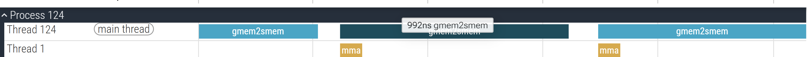
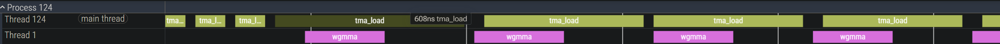

# Learn CuTeDSL

**CuTeDSL** is a Python-embedded domain-specific language that wraps CUDA/PTX. It gives you quality-of-life APIs for writing efficient GPU kernels — think Layout algebra, Swizzle, Copy Atoms, MMA Atoms, TMA descriptors — while staying close enough to the hardware to hit speed-of-light (SoL) performance. Kernels integrate seamlessly with PyTorch via DLPack and compile fast thanks to an MLIR/NVVM backend.

This repo adds hardware features and optimization techniques gradually, measuring the FLOPS gain at each step so you see exactly what you are buying. Beyond the kernels, the repo also serves as a **reference for commonly used CuTeDSL APIs**. Each concept — Layout arithmetic, Swizzle composition, TV-to-MN coordinate mapping, `mbarrier` synchronization — is isolated and explained with minimal surrounding noise, making it easy to lift a pattern into your own code or feed it as context to an LLM. Here, you can find kernels for Ampere (SM80), Hopper (SM90), Blackwell (SM100) and Blackwell RTX (SM120).

**Why CuTeDSL over CUTLASS C++?**
- No template metaprogramming maze, much faster iteration and easier to get started
- Python quality of life: Pylance, Intellisense, preferred language by AIs,...
- Same low-level control: you can drop to raw PTX whenever you need it
- JIT compilation (`@cute.jit`) or AOT (`cute.compile`) with PyTorch zero-copy interop

**Known rough edges:**
- Many APIs overlap in purpose — the versatility that makes it powerful can also be confusing
- Documentation is sparse; official examples tend to go straight for SoL complexity
- This repo exists partly to fill that gap: one concept per script, explained step by step

---

**What lies ahead in this document:**

Section 1 walks through the optimization progression with measured FLOPS gains at each step. Section 2 explains the core CuTeDSL APIs you will encounter everywhere: Layout, Shared Memory, Copy Atoms, and MMA Atoms. Section 3 dives into TV Layout for mapping thread registers to `(m, n)` coordinates, enabling layer fusion without materializing large tensors. Section 4 covers TMA and WGMMA together — the two Hopper hardware features that power the async pipeline. Section 5 builds a full async warp-specialized pipeline, contrasting `PipelineAsync` and `PipelineTmaAsync` and the SM120 fallback. Section 6 shows how to profile the pipeline with inline PTX clock reads. Section 7 introduces the Blackwell tcgen05 tensor core instruction.

## Frequently used APIs explanation 
(Click the arrow to expand section)

<details>
<summary><strong>1. Learning Curve and FLOPS Gain</strong></summary>

CuTeDSL and CUDA in general have a very steep but rewarding learning curve, so don't get frustrated the first time you try it. The best approach is to look at examples, write kernels yourself, and observe the performance speedup — and understand *why* it speeds up. Once you can wrap your head around the concept of massively parallel programming with CUDA, subsequent kernels become much easier to digest.

**Suggested progression:**

1. **Vector addition (a0)** — the classic gateway CUDA example. Plenty of online explanations exist. A CuTeDSL version is provided in this repo. CUDA has a broader ecosystem of YouTube videos and blog posts than CuTeDSL, but CuTeDSL is essentially a Python wrapper over CUDA/PTX so the concepts transfer directly.

2. **Naïve GEMM (a1)** — understand how to perform General Matrix Multiplication in a parallel fashion using one thread per output element (`tidx, tidy, _ = cute.arch.thread_idx()`).

3. **Shared memory GEMM (a2)** — load tiles of A and B into fast on-chip shared memory (SMEM) to reuse data and reduce global memory traffic, producing a significant FLOPS improvement.

4. **WMMA tensor core (b-series)** — use Warp Matrix Multiply-Accumulate instructions to leverage the dedicated tensor core hardware. Lei Mao's blog provides great explanation: https://leimao.github.io/blog/NVIDIA-Tensor-Core-Programming/. Note: in CuTeDSL/CUTLASS the convention is to wrap PTX instructions directly (lower level than the CUDA C++ `wmma` API).

5. **Hopper TMA + WGMMA (c-series)** — move to Hopper SM90 with Tensor Memory Accelerator and Warp Group MMA, combined with the new async barrier primitives for true pipelined overlap of memory and compute.

6. **Blackwell tcgen05 (d-series)** — the next generation matrix instruction on SM100/SM120.

**FLOPS progression** (M=N=K=4096, dtype=float16, measured on H100):

| Stage | Script | Architecture | TFLOPS |
|---|---|---|---|
| Naïve GEMM | [`a1`](https://github.com/luongthecong123/learn-cutedsl/blob/main/cutedsl/a1_naive_cute.py) | Any | 0.58 |
| Shared memory GEMM | [`a2`](https://github.com/luongthecong123/learn-cutedsl/blob/main/cutedsl/a2_smem_cuda_like.py) | Any | 7.17 |
| WMMA tensor cores + SMEM | [`b2`](https://github.com/luongthecong123/learn-cutedsl/blob/main/cutedsl/b2_wmma_smem.py) | Ampere+ (SM80+) | 145.49 |
| WMMA + TMA load/store | [`b5`](https://github.com/luongthecong123/learn-cutedsl/blob/main/cutedsl/b5_wmma_tma_load_store.py) | Hopper+ (SM90+) | 186.88 |
| WGMMA + TMA load/store | [`c1`](https://github.com/luongthecong123/learn-cutedsl/blob/main/cutedsl/c1_wgmma_tma_load_store.py) | Hopper (SM90) | 429.90 |
| WGMMA + TMA pipeline | [`c2`](https://github.com/luongthecong123/learn-cutedsl/blob/main/cutedsl/c2_wgmma_tma_pipeline.py) | Hopper (SM90) | 515.15 |
| WGMMA + TMA warp-specialized pipeline | [`c3`](https://github.com/luongthecong123/learn-cutedsl/blob/main/cutedsl/c3_wgmma_tma_specialized_pipeline.py) | Hopper (SM90) | 600.45 |
| tcgen05 + TMA | [`d1`](https://github.com/luongthecong123/learn-cutedsl/blob/main/cutedsl/d1_tcgen05_tma.py) | Blackwell (SM100) | TBD |
| tcgen05 + TMA specialized pipeline | `d2` | Blackwell (SM100) | TBD |

We can improve further by using techniques such as Persistent kernel to overlap epilogue with the start of the next tile, TMA Multicast, Larger tile size through register pressure management, TMEM staging in Blackwell,... to reach Speed of Light which is around 720 TFLOPS for H100 and 1500 TFLOPS for B200.

</details>

<details>
<summary><strong>2. CuTeDSL Fundamentals</strong></summary>

The building blocks you will encounter in every CuTeDSL kernel: how host and device code are structured, how to interface with PyTorch, and the core abstractions — Layout, Shared Memory, Copy Atoms, and MMA Atoms.

### Host Code vs. Device Code

```python
@cute.jit   # host-side entry point
def my_launcher(mA: cute.Tensor, ...):
    my_kernel(...).launch(grid=[...], block=[...])

@cute.kernel   # device-side kernel — runs on the GPU
def my_kernel(...):
    ...
```

- **[`@cute.jit`](https://github.com/luongthecong123/learn-cutedsl/blob/main/cutedsl/a0_vector_addition.py#L11)** marks the host function. It triggers JIT compilation when first called and handles argument marshalling. You can also call `cute.compile(fn, *sample_args)` explicitly for **AOT** (ahead-of-time) compilation, which compiles once and caches the result for reuse — as done in the [`main()` of every script](https://github.com/luongthecong123/learn-cutedsl/blob/main/cutedsl/a0_vector_addition.py#L47).

- **[`@cute.kernel`](https://github.com/luongthecong123/learn-cutedsl/blob/main/cutedsl/a0_vector_addition.py#L21)** marks the GPU kernel. Inside it, thread/block coordinates are queried with:
  ```python
  bidx, bidy, _ = cute.arch.block_idx()
  bdimx, bdimy, _ = cute.arch.block_dim()
  tidx, tidy, _ = cute.arch.thread_idx()
  ```

### Interfacing with PyTorch

```python
from cutlass.cute.runtime import from_dlpack

A_ = from_dlpack(A, assumed_align=16)   # wrap a torch.Tensor as a cute.Tensor
```

PyTorch tensors on the GPU are pointers into VRAM with metadata. **[`from_dlpack`](https://github.com/luongthecong123/learn-cutedsl/blob/main/cutedsl/a0_vector_addition.py#L43)** uses the DLPack protocol to share that pointer with CuTeDSL without copying data. No glue code (like `cuda/glue_code.cu`) is needed — CuTeDSL handles the bridge via MLIR/NVVM, making compilation much faster than traditional CUDA C++ extension workflows.

### Layout and Linear indexing

When performing matrix multiplication we write `A[i, j] * B[j, k] = C[i, k]`, which uses 2-D indexing. Physical GPU memory is flat (1-D), so under the hood this multi-dimensional index is collapsed to a single pointer offset. In CUDA kernels we pass only a pointer to the first element of each memory block — no copies are made. CuTe's **Layout** abstraction makes this index arithmetic explicit and composable.

Arguably the most important concept in CUTLASS CuTe / CuTeDSL. A `Layout` pairs a **shape** (extents in each dimension) with a **stride** (step size in linear memory per dimension). For example, a row-major 4×8 matrix has `shape=(4,8), stride=(8,1)` — moving one row down jumps 8 elements in memory.

**Construction:**
```python
# cute.make_layout(shape, stride)
layout = cute.make_layout((BM, BK), stride=(BK + PAD, 1))
```
*Used in [`a2_smem_cuda_like.py` L32](https://github.com/luongthecong123/learn-cutedsl/blob/main/cutedsl/a2_smem_cuda_like.py#L32) to define padded shared memory layouts that avoid bank conflicts.*

**Index arithmetic:**
```python
# Flatten multi-dim coordinate → linear offset
offset = cute.crd2idx(coord, layout)

# Unflatten linear index → coordinate
coord = cute.idx2crd(idx, shape)
```
*Used in [`z1_tv2mn.py` L16–L25](https://github.com/luongthecong123/learn-cutedsl/blob/main/cutedsl/z1_tv2mn.py#L16) to decode thread/register indices into logical (m, n) output coordinates.*

**Tiling a global tensor into CTA-sized tiles:**
```python
# cute.local_tile(tensor, tiler, coord, proj)
# Returns the sub-tile of `tensor` that this CTA is responsible for.
gA_tile = cute.local_tile(gA, tiler=tiler, coord=coord, proj=(1, None, 1))
```
*Used in [`a1_naive_cute.py` L30](https://github.com/luongthecong123/learn-cutedsl/blob/main/cutedsl/a1_naive_cute.py#L30). `proj` masks out dimensions so the tile retains the K-iteration axis.*

**Swizzle-composed Layout:**

Bank conflicts occur when multiple threads in a warp access different addresses that map to the same shared memory bank. A **Swizzle** applies an XOR permutation to the row address, spreading accesses across banks. `make_swizzle(B, M, S)` defines the XOR pattern via three bit-field parameters.

```python
# cute.make_swizzle(B, M, S) — XOR permutation parameters
# cute.make_composed_layout(inner=swizzle, offset=0, outer=base_layout)
layout_sA_swizzled = cute.make_composed_layout(
    inner=cute.make_swizzle(3, 4, 3),
    offset=0,
    outer=layout_sA
)
```
*Used in [`a2_smem_cuda_swizzled.py` L35–L39](https://github.com/luongthecong123/learn-cutedsl/blob/main/cutedsl/a2_smem_cuda_swizzled.py#L35). See [`z0_swizzle.py`](https://github.com/luongthecong123/learn-cutedsl/blob/main/cutedsl/z0_swizzle.py#L7) for a standalone swizzle demo.*


### Shared Memory

Shared memory (SMEM) is an on-chip scratchpad shared by all threads in a block — roughly 100× lower latency than global memory. In CuTeDSL, SMEM is allocated with:

```python
# cutlass.utils.SmemAllocator — manages a contiguous SMEM buffer
# .allocate_tensor(dtype, layout, alignment, init) → cute.Tensor backed by SMEM
allocator = cutlass.utils.SmemAllocator()
sA = allocator.allocate_tensor(cutlass.Float16, layout_sA, 16, None)
```
*Used in [`a2_smem_cuda_like.py` L31–L35](https://github.com/luongthecong123/learn-cutedsl/blob/main/cutedsl/a2_smem_cuda_like.py#L31).*

After cooperatively loading a tile from global memory into SMEM, threads must synchronize before reading:

```python
cute.arch.sync_threads()   # equivalent to __syncthreads() in CUDA C++
```
*Used in [`a2_smem_cuda_like.py` L58](https://github.com/luongthecong123/learn-cutedsl/blob/main/cutedsl/a2_smem_cuda_like.py#L58). For async pipelines (TMA), `mbarrier`-based synchronization replaces this — see Section 6.*


### Copy Atom

A **Copy Atom** is the smallest unit of a hardware copy operation. A **Tiled Copy** wraps the atom and distributes the work across all threads in a CTA to fill or drain a tile efficiently.

```python
# cute.make_copy_atom(op, dtype, num_bits_per_copy) → CopyAtom
# cute.make_tiled_copy(atom, thread_layout, value_layout) → TiledCopy
atom_copy_A = cute.make_copy_atom(
    cute.nvgpu.CopyUniversalOp(),
    mA.element_type,
    num_bits_per_copy=mA.element_type.width * num_vectorized   # vectorized load
)
```
*Used in [`b2_wmma_smem.py` L63–L67](https://github.com/luongthecong123/learn-cutedsl/blob/main/cutedsl/b2_wmma_smem.py#L63) for GMEM → SMEM copies with vectorization.*

Once you have a `TiledCopy`, you slice it per-thread and partition source/destination tensors:

```python
thr_copy = tiled_copy.get_slice(tid)        # per-thread view of the tiled copy
tAsA = thr_copy.partition_S(sA)             # source partition (this thread's slice of sA)
tAgA = thr_copy.partition_D(gA)             # destination partition (this thread's slice of gA)
cute.copy(tiled_copy, tAgA, tAsA)           # every thread copies its own subtensor
```

> **Naming convention** — the prefix encodes both the partitioner and the tensor. `tAsA` is read as *"partitioning pattern `tA` applied to tensor `sA`"*. The same partitioner `tA` is applied to both `sA` (shared memory) and `gA` (global memory) to produce `tAsA` and `tAgA`. Because both tensors use *the same* partitioning pattern, CuTe can assert that corresponding logical elements match across the two tensors, even if their physical data layouts differ. When you later write `cute.copy(tiled_copy, tAgA, tAsA)`, you can lexically verify that source and destination are partitioned consistently — a naming convention borrowed directly from CUTLASS CuTe C++. The prefix letter also encodes the memory space: `s` = shared memory, `g` = global memory, `r` = register.

| Copy Op | Direction | Notes |
|---|---|---|
| `CopyUniversalOp` | any | Generic register-to-register or GMEM → register |
| `LdMatrix8x8x16bOp` | SMEM → register | `ldmatrix` instruction; loads data in the exact layout tensor cores expect. Used in [`b2_wmma_smem.py` L156–L161](https://github.com/luongthecong123/learn-cutedsl/blob/main/cutedsl/b2_wmma_smem.py#L156) |
| `CopyBulkTensorTileG2SOp` | GMEM → SMEM | TMA async load, Hopper+. Used in [`c1_wgmma_tma_load_store.py` L424](https://github.com/luongthecong123/learn-cutedsl/blob/main/cutedsl/c1_wgmma_tma_load_store.py#L424) |
| `CopyBulkTensorTileS2GOp` | SMEM → GMEM | TMA async store. Used in [`c1_wgmma_tma_load_store.py` L92](https://github.com/luongthecong123/learn-cutedsl/blob/main/cutedsl/c1_wgmma_tma_load_store.py#L92) |


### MMA Atom

An **MMA Atom** wraps a single hardware matrix-multiply-accumulate instruction. A **Tiled MMA** tiles this atom across threads and repeats it to cover a larger output tile.

```python
# Define the hardware instruction
mma_op = cute.nvgpu.warp.MmaF16BF16Op(
    ab_dtype=cutlass.Float16, acc_dtype=cutlass.Float32, shape_mnk=(16, 8, 16))

# Tile it: atom_layout_mnk=(4,4,1) means 4×4 warp-level tiles → 512 threads
tiled_mma = cute.make_tiled_mma(
    op_or_atom=mma_op,
    atom_layout_mnk=(4, 4, 1),
    permutation_mnk=(64, 64, 16))
```
*Used in [`b2_wmma_smem.py` L36–L53](https://github.com/luongthecong123/learn-cutedsl/blob/main/cutedsl/b2_wmma_smem.py#L36).*

Once you have a `TiledMma`, slice it per-thread and partition the operand tiles:

```python
thr_mma = tiled_mma.get_slice(tid)    # per-thread view
tCsA = thr_mma.partition_A(sA)        # A operand partition for this thread (partitioner tC, tensor sA)
tCsB = thr_mma.partition_B(sB)        # B operand partition (partitioner tC, tensor sB)
tCgC = thr_mma.partition_C(gC)        # C accumulator partition (partitioner tC, tensor gC)

tCrC = tiled_mma.make_fragment_C(tCgC)   # allocate register fragment for C
tCrC.fill(cute.Float32(0))

cute.gemm(tiled_mma, tCrC, tCrA, tCrB, tCrC)   # issue MMA
```

> **Naming convention** — the same `tC` partitioner (derived from `thr_mma`) is applied to `sA`, `sB`, and `gC` to produce `tCsA`, `tCsB`, and `tCgC`. This is the *math partitioning* counterpart of the copy partitioning above. Because `tCsA` and `tAgA` use *different* partitioners (`tC` vs `tA`), they cannot be passed directly to `cute.copy` — you first need to `retile` the copy view to match the MMA layout, as done with `thr_copy_ldmatrix.retile(tCrA)` in [`b2_wmma_smem.py` L171](https://github.com/luongthecong123/learn-cutedsl/blob/main/cutedsl/b2_wmma_smem.py#L171).
*Used in [`a1_naive_cute.py` L43–L44](https://github.com/luongthecong123/learn-cutedsl/blob/main/cutedsl/a1_naive_cute.py#L43) and [`b2_wmma_smem.py` L143–L147](https://github.com/luongthecong123/learn-cutedsl/blob/main/cutedsl/b2_wmma_smem.py#L143).*

| MMA Op | GPU | Notes |
|---|---|---|
| `MmaUniversalOp` | all | Scalar FMA tiled to any shape — used for naïve cute GEMM in [`a1_naive_cute.py` L37](https://github.com/luongthecong123/learn-cutedsl/blob/main/cutedsl/a1_naive_cute.py#L37) |
| `MmaF16BF16Op` (warp) | Ampere+ | `wmma`-style warp-level MMA — used in [`b2_wmma_smem.py` L36](https://github.com/luongthecong123/learn-cutedsl/blob/main/cutedsl/b2_wmma_smem.py#L36) |
| WGMMA atom | Hopper SM90 | Warp-group async MMA reading operands from SMEM — used in [`c1_wgmma_tma_load_store.py`](https://github.com/luongthecong123/learn-cutedsl/blob/main/cutedsl/c1_wgmma_tma_load_store.py) |
| tcgen05 atom | Blackwell SM100 | Next-gen tensor core — used in [`d1_tcgen05_tma.py`](https://github.com/luongthecong123/learn-cutedsl/blob/main/cutedsl/d1_tcgen05_tma.py) |

</details>

<details>
<summary><strong>3. TV Layout for Thread-Register → MN Coordinate Mapping and Layer Fusion</strong></summary>

In CUDA optimization, one strategy is to fuse multiple operations — for example, performing GEMM and immediately applying an element-wise transformation on the accumulator — without ever materializing the large output tensor to global memory. This requires knowing exactly which thread holds which output element.

For example, in a custom RNN kernel that achieved 90–110× speedup over PyTorch, the key insight was to avoid materializing the large matC, then performing a GEMV (matrix-vector multiplication) on it afterwards. Instead, the GEMV was fused directly into the accumulator registers. This requires mapping each thread's accumulator registers to logical `(m, n)` coordinates.

By reading the PTX documentation one can derive this mapping manually with modulo and integer division (see the C++ `tv2mn` template in `README.md`). CuTe provides this formula automatically through the **TV Layout** of the MMA atom.

Printing the atom and tiled MMA for the warp-level `F16/BF16 → F32` instruction (script `b2_wmma_smem.py`) gives:

```
TV Layout C:     ((4,8),(2,2)):((32,1),(16,8))
```

- `(4,8)` → 32 threads (one warp)
- `(2,2)` → 4 registers per thread for the accumulator fragment

After tiling this atom 4×4 (512 threads total), the tiled TV layout becomes:

```
tv_layout_C_tiled:
((4,8,4,4),((2,2),(1,2))):((128,1,16,512),((64,8),(0,2048)))
```

To loop over each accumulator register and recover its logical `(m, n)` coordinate:

```python
for reg_idx in range(cute.size(tCrC_out)):
    coord = cute.idx2crd((tid, reg_idx), tv_layout_C_tiled.shape)
    mn_flat = cute.crd2idx(coord, tv_layout_C_tiled)
    m, n = cute.idx2crd(mn_flat, fragC_layout.shape)
```

For example, with `tid=11` and `reg_idx=3`, `coord` is `((3,2,0,0),((1,1),(0,0)))`, `mn_flat` is `1547`, and the resulting logical coordinate is `m=11, n=24`. See `z1_tv2mn.py` for a runnable demo.

This same "do not materialize" pattern underpins the **Implicit GEMM** algorithm, where the `im2col` matrix is computed on the fly tile-by-tile and loaded into SMEM, allowing convolution to use tensor cores efficiently.

</details>

<details>
<summary><strong>4. TMA and WGMMA (Hopper)</strong></summary>

Hopper (SM90) introduced two complementary hardware features that together enable the high-throughput async pipeline: **TMA** offloads the memory side and **WGMMA** accelerates the compute side. They are described together because understanding both is necessary to make sense of the pipeline in Section 5.

---

### Tensor Memory Accelerator (TMA)

Without TMA the data flow for loading a tile is:

```
GMEM → registers → SMEM
```

This consumes register file capacity. TMA short-circuits this:

```
GMEM → SMEM   (direct, asynchronous, no register allocation)
```

The issuing thread returns immediately after launching the TMA copy; the hardware writes data into shared memory in the background and signals completion via an **mbarrier** (see Section 5 for details). This leaves more registers free for computation. TMA also handles multi-dimensional address calculations, stride, and boundary clamping in hardware, removing that logic from the kernel.

Example `c1_wgmma_tma_load_store.py` shows TMA as a drop-in replacement for manual `cp.async` SMEM loading, yielding a clean speedup while remaining portable to SM90, SM100, and SM120.

Key API:
```python
tma_atom = cute.nvgpu.cpasync.TmaLoad(...)
cute.copy(tma_atom, gmem_src, smem_dst, tma_bar_ptr=barrier)
```

---

### Warp Group Matrix Multiplication (WGMMA)

**WGMMA** is a faster tensor core instruction that requires a full **warpgroup** (4 warps = 128 threads) to issue together. Key properties:

- **Asynchronous**: `cute.gemm(tiled_mma, ...)` returns immediately while the tensor cores compute in the background, reading operands directly from **shared memory** (not registers).
- **Higher throughput** than the register-based `mma` / `wmma` instructions used on earlier GPUs.
- **Requires new synchronization primitives** to track when the hardware has finished reading from SMEM before that stage can be released back to the producer.

The three WGMMA fence/commit/wait primitives:

| Primitive | Purpose |
|---|---|
| `warpgroup.fence()` | Ensures prior memory ops are ordered before WGMMA issues |
| `warpgroup.commit_group()` | Seals all WGMMA instructions issued since the last commit into one group |
| `warpgroup.wait_group(N)` | Blocks until at most N committed groups are still in-flight |

For example, if `BK=64` and `WGMMA_K=16`, we issue 4 WGMMA calls in a loop and then call `commit_group()` to group them into one trackable unit. `wait_group(0)` blocks until that group finishes, ensuring SMEM is safe to reuse.

</details>

<details>
<summary><strong>5. Asynchronous Pipeline: PipelineAsync vs PipelineTmaAsync</strong></summary>

Hopper's new barrier primitives allow us to overlap memory transactions and computation. CuTeDSL exposes this via `PipelineAsync` and `PipelineTmaAsync`.

### Warp Specialization

We split work by **role** rather than by data:

- **Producer warps** — handle memory (GMEM → SMEM)
- **Consumer warps** — handle computation (MMA on registers or WGMMA from SMEM)

Different warps can take entirely different code paths with zero divergence penalty because they are independently scheduled by the GPU. This is called **warp specialization**.

```python
if warp_group_idx == 0:    # Producer warps — handle memory
    ...
if warp_group_idx == 1:    # Consumer warps — handle computation
    ...
```

### Pipeline Communication via Barriers in Shared Memory

Producer and consumer warps communicate via **`mbarrier`** objects stored in shared memory (visible to all threads in a block). Each pipeline stage gets its own barrier, organized as a **circular buffer** — after the last stage we wrap back to stage 0.

Each barrier tracks a **phase** that alternates between even and odd. The two race conditions that barriers prevent:

- **Producer overwrite** — producer `acquire` blocks until the consumer has released that stage (data fully consumed).
- **Consumer underread** — consumer `wait` blocks until the producer has committed to that stage (data fully written).

With `S` stages the producer can run up to `S` iterations ahead of the consumer, hiding memory latency behind computation.

### PipelineAsync (Synchronous Writes + Synchronous MMA)

Used when the producer writes to SMEM via regular thread stores (synchronous) and the consumer uses register-based MMA (synchronous). The only concern is preventing race conditions between the two warpgroups.

```python
# Setup
pipeline = PipelineAsync.create(
    num_stages=S,
    producer_group=CooperativeGroup(Agent.Thread, 128),
    consumer_group=CooperativeGroup(Agent.Thread, 128),
    barrier_storage=mbar_ptr,
)
producer, consumer = pipeline.make_participants()

# Producer
for k in range(K):
    handle = producer.acquire_and_advance()   # wait for stage to be free
    smem[handle.index] = data[k]              # threads write to SMEM synchronously
    handle.commit()                           # signal "data ready"
producer.tail()

# Consumer
for k in range(K):
    handle = consumer.wait_and_advance()      # wait for "data ready"
    result += smem[handle.index]              # threads read from SMEM / issue MMA
    handle.release()                          # signal "stage free"
```

### PipelineTmaAsync (Async TMA Loads + Async WGMMA)

Used on Hopper when both the producer (TMA) and consumer (WGMMA) are asynchronous. Two complementary mechanisms track completion:

- **TMA completion**: tracked via **transaction byte counting** on barriers. The `tx_count` parameter tells the pipeline how many bytes to expect per stage. TMA hardware automatically decrements the barrier's counter as bytes land in SMEM — `producer_commit()` is a NOP.
- **WGMMA completion**: tracked via `commit_group()` / `wait_group()` as described above.

Because the consumer must wait for WGMMA to finish reading before releasing a stage, it uses **two separate state trackers**: `consumer_read_state` and `consumer_release_state`.

The producer uses a **prefetch phase** to fill all `S` pipeline stages before the steady-state loop, maximizing overlap:

```
Stage S lifecycle
─────────────────
Producer (TMA warp)                  Consumer (MMA warps)
      │                                     │
      ├─ producer_acquire(S)                │
      ├─ TMA copy A/B → smem[S]            │
      │   (tied to barrier via tma_bar_ptr) │
      ├─ producer_commit(S) [NOP]           │
      │    TMA hw decrements tx_count       │
      │         tx_count hits 0 ──────►     ├─ consumer_wait(S) unblocks
      │                                     ├─ warpgroup.fence()
      │                                     ├─ WGMMA reads smem[S] (async)
      │                                     ├─ warpgroup.commit_group() → G_k
      │                                     ├─ warpgroup.wait_group(0)
      │  ◄──────────────────────────────────├─ consumer_release(S)
```

### What About SM120 (Blackwell RTX)?

SM120 has TMA but **no WGMMA**. It uses register-based MMA (`ldmatrix` + `mma`). Key differences from SM90:

- `ldmatrix` and `mma` are **synchronous** — no `fence`/`commit_group`/`wait_group` needed.
- Only **one consumer state tracker** needed — the stage can be released as soon as `ldmatrix` finishes (MMA never reads SMEM).
- `consumer_release` happens **inside** the k_block loop at the boundary after the last `ldmatrix` of each stage.
- **Double-buffering** the `ldmatrix` for the next k_block with MMA of the current k_block hides `ldmatrix` latency — classic software pipelining.

See [Junkai Wu's dense_gemm SM120 example](https://github.com/NVIDIA/cutlass/blob/main/python/examples/blackwell_rtx/dense_gemm.py) for the full implementation.

</details>

<details>
<summary><strong>6. Profiling Async Pipelines with Probing</strong></summary>

To verify that our async pipeline is actually overlapping memory and compute, we need timing measurements inside the kernel. Taking inspiration from [gau-nernst's blog post](https://gau-nernst.github.io/tcgen05/), the probing technique uses **inline PTX** to call the `globaltimer` instruction, which returns the current GPU clock in nanoseconds.

CuTeDSL exposes this via `cute.arch.inline_ptx`, which lets you embed raw PTX instructions directly in Python kernel code:

```python
# Read GPU nanosecond clock — wraps the PTX: mov.u64 %0, %globaltimer;
clock = cute.Integer(cute.UInt64(0))
cute.arch.inline_ptx(
    "mov.u64 $0, %globaltimer;",
    outputs=[clock],
    inputs=[],
)
```

Alternatively, if the CuTeDSL version provides it as a built-in:

```python
clock = cute.arch.read_clock()   # shorthand wrapping the same PTX
```

Each warp records timestamps at the start and end of its producer (TMA load) or consumer (WGMMA / MMA) work. The timestamps are written to a small global memory buffer, then post-processed on the CPU and visualized on [Perfetto](https://ui.perfetto.dev).

**Important caveats about the profiling kernel (`a2_smem_pipeline_profile.py`, `c3_wgmma_tma_specialized_pipeline_profile.py`):**

- Only **2 warps per block** are launched — very low occupancy by design so the timeline is readable.
- The SMEM loading is the main bottleneck; it can be accelerated with vectorized loads or TMA.
- The MMA completes very quickly (low Arithmetic Intensity = FLOPS / bytes transferred), so the pipeline profile shows a memory-bound workload.

**Profile of PipelineAsync (a2):**

The figure below shows producer (SMEM load) and consumer (MMA) timelines per warp. With only 2 warps there is limited overlap, but the barrier handoff between producer and consumer is clearly visible.



**Profile of PipelineTmaAsync (c3, 64×128×64 tile):**

Running `c3_wgmma_tma_specialized_pipeline_profile.py` and visualizing on Perfetto shows the first 3 prefetched TMA loads (filling the pipeline), followed by well-overlapped WGMMA compute and TMA loads in the steady state. Launch overhead is still visible at the start.



</details>

<details>
<summary><strong>7. Blackwell tcgen05 Matrix Multiplication</strong></summary>

Blackwell (SM100) introduces **tcgen05**, a new generation of tensor core instruction designed for the new architecture. Like WGMMA on Hopper, it requires multiple warps working together and is issued asynchronously. CuTeDSL exposes it through the `tcgen05` MMA atom.

Script `d1_tcgen05_tma.py` provides an example of tcgen05 combined with TMA loads.

> Full documentation coming soon.

</details>

## Job Submission

**Using Ray:**
```bash
pip install ray
# Assume a Ray cluster is already running

ray job submit \
    --address 'http://localhost:8265' \
    --working-dir . \
    --runtime-env-json='{"pip":"./requirements.txt"}' \
    -- python submit_ray.py
```

**Using Modal:**
```bash
pip install modal
python3 -m modal setup

modal run submit_modal.py
```

## Reference

1. https://github.com/NVIDIA/cutlass/blob/main/examples/python/CuTeDSL
2. https://cudaforfun.substack.com/p/outperforming-cublas-on-h100-a-worklog
3. https://research.colfax-intl.com/tutorial-hopper-tma/
4. https://research.colfax-intl.com/cutlass-tutorial-wgmma-hopper/
5. https://gau-nernst.github.io/tcgen05/
6. https://hazyresearch.stanford.edu/blog/2026-02-19-tk-2
7. https://github.com/LeiWang1999/CPPTorchExecutable
8. https://docs.nvidia.com/cutlass/latest/media/docs/pythonDSL/overview.html
9. https://research.colfax-intl.com/cutlass-tutorial-writing-gemm-kernels-using-tensor-memory-for-nvidia-blackwell-gpus/