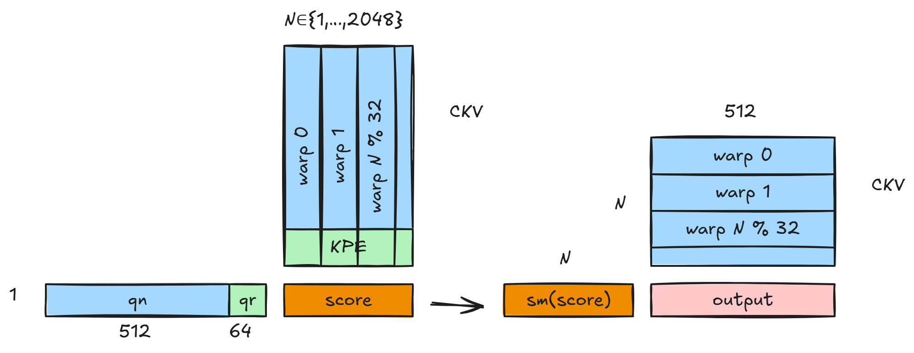
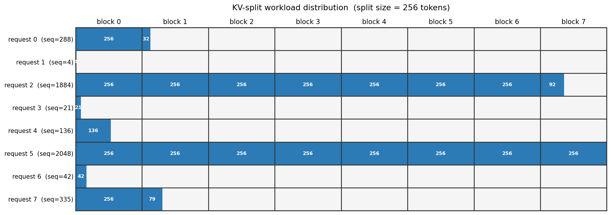
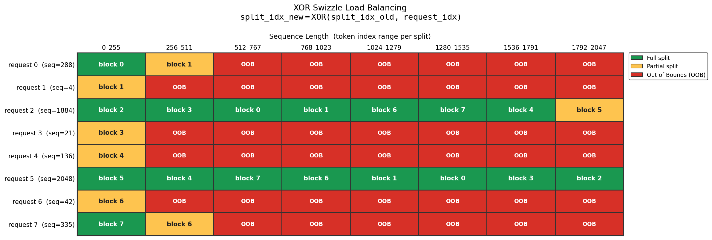
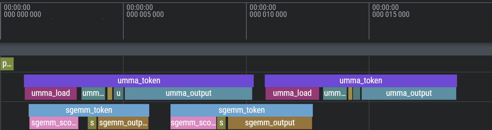
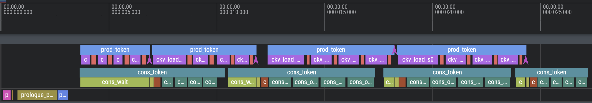
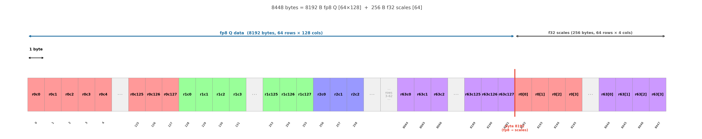
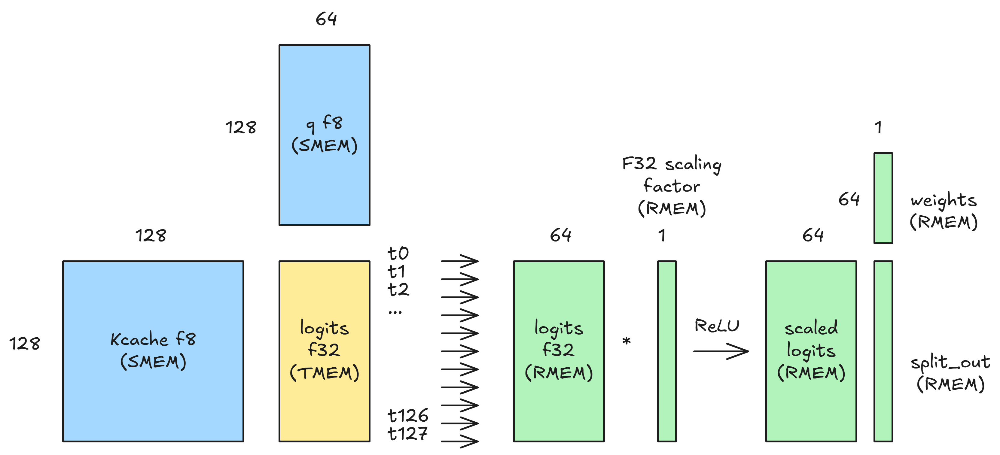

<h3 align="center">Batch inference load-balancing with persistent KV-split swizzle</h3>
<p align="center">The Cong Luong</p>

This technical write-up presents my solution to FlashInfer AI Kernel Generation Contest @ MLSys 2026. I initially decided to go with the Deepseek Sparse Attention [1] (DSA) track because I haven't written an attention kernel before, and this would be a very good opportunity for me to learn. To prep for this kernel, I wrote a naive implementation of flash attention [2] at `fused_kernel/spda0_naive.py`, where we do softmax(Q@K.T) @ V in a single kernel. The flaw of this naive kernel is that I partitioned the output matrix to 2D, which hurts the performance as for each tile_N, we have to redo (N // tile_N) times the computation of Q @ K.T. Therefore, to ensure the best performance, we should only do 1D partition for the output by tiling it along the M dimension. The concept is pretty much the same for Deepseek Sparse Attention, except that here, we are doing Flash decoding [3] instead, where we process only one token at a time, thanks to KV cache skip. 

Can this kernel beat Flashinfer/TRT_LLM hand-crafted by Nvidia's kernel engineers on high throughput workloads (8x2048)? No, but it can beat it in cases where the requests per workload are imbalanced thanks to designing a very dynamic kernel that can decide in the prologue when to perform heavy or light computation, when to early exit and which part of the input should be selected.

To benchmark my kernels with Modal on a few notable workloads which make the kernel branch to different sub-kernel:

```bash
modal run fused_kernel/run_dsa_modal.py --kernel attn
modal run fused_kernel/run_dsa_modal.py --kernel indexer
```
it should output something like:
DSA Attn `fused_kernel/dsa_attn.py`
```bash
uuid=9d4a5f21 T=2  median =    5.504 us  (100 iters)
uuid=385742b2 T=8  median =   21.504 us  (100 iters)
uuid=2207f0fd T=7  median =   31.648 us  (100 iters)
```

DSA Attn `fused_kernel/dsa_attn_tcgen05_warpspec.py`
```bash
uuid=9d4a5f21 T=2  median =   10.400 us  (100 iters)
uuid=385742b2 T=8  median =   22.560 us  (100 iters)
uuid=2207f0fd T=7  median =   24.416 us  (100 iters)
```
Compare these 2 kernels on larger workloads, we have the following table:
| # | UUID | MFLOPs | dsa ms | GFLOPS/s | dsa ws ms | GFLOPS/s | Δ GFLOPS/s |
|---:|---|---:|---:|---:|---:|---:|---:|
| 10 | 385742b2 |  58.03 | 0.021 | 2763 | 0.023 | 2523 |  −240 |
| 12 | 38389961 |  58.70 | 0.027 | 2174 | 0.022 | 2668 | **+494** |
| 13 | 02d6ae9c |  84.59 | 0.025 | 3384 | 0.022 | 3845 | **+461** |
| 14 | ddfa9e34 |  61.00 | 0.021 | 2905 | 0.025 | 2440 |  −465 |
| 15 | 78b2e11c |  91.71 | 0.028 | 3275 | 0.024 | 3821 | **+546** |
| 17 | 564007ac | 166.04 | 0.034 | 4883 | 0.033 | 5032 | **+149** |
| 18 | ae4219a9 |  80.54 | 0.023 | 3502 | 0.023 | 3502 |     ±0 |
| 19 | 232ed014 |  59.22 | 0.027 | 2193 | 0.022 | 2692 | **+499** |
| 20 | 7a389715 |  61.49 | 0.021 | 2928 | 0.025 | 2460 |  −468 |
| 21 | 5096e459 | 157.49 | 0.036 | 4375 | 0.032 | 4922 | **+547** |
| 22 | d57eb9e1 | 114.53 | 0.033 | 3471 | 0.030 | 3818 | **+347** |
| 23 | 2207f0fd | 125.59 | 0.031 | 4051 | 0.025 | 5024 | **+972** |
| | **Arith** | | **0.027** | **3325** | **0.026** | **3562** | **+237** |
| | **Geo**   | | **0.027** | **3233** | **0.025** | **3431** | **+198** |

DSA Indexer `fused_kernel/dsa_indexer.py`
```bash
uuid=30cecff1 T=1 max_pages=1 max_sl=2      median =    1.952 us  (100 iters)
uuid=ef12ac76 T=4 max_pages=44 max_sl=2753  median =   15.328 us  (100 iters)
```

### 1. Deepseek Sparse Attention kernel

The code for this is at `fused_kernel/dsa_attn.py`

DSA uses Multi-head latent attention, with KV of maximum length 2048. Decoding is really memory bound and doesn't benefit much from B200's high throughput tensor core engines. Here, I will try to use all the 148 SMs that B200 offers. In the detailed link I shared above, I will also explain a more over-engineered kernel with tcgen05.mma (UMMA), cp.async, FFMA2, warp specialization to overlap full split and partial/tail split computation `dsa_attn_tcgen05_warpspec.py`, also a kernel with pipeline staging to overlap score and output computation `dsa_attn_tcgen05_warpspec_pipeline_staging.py`, those kernels weren’t in the final submission since they only improved 500 GFLOPS/s on larger workloads, it would benefit from having max num pages as input like in DSA indexer for kernel routing.

For small workloads (1,2,3,…7) I used a fully fused kernel with just warp reduction, 3 levels of reduction [5] (thread, warp reduction and thread block reduction on SMEM), these runs for just 1 wave, I set up the grid as grid=[T, num_heads, 1], so each block (each SM as our register usage only allow 50% occupancy per SM) gets a unique head, so for 8 requests, we can have 128 SMs working (tensor parallelism gives each GPU 16 heads). Figure 1 shows the algorithm for this fully fused kernel, I launch the kernel with block size of 1024 threads, or 32 warps, each warp will independently calculate a column in score matrix with warp reduction, lane 0 will write results to score in SMEM. Then softmax will be applied. For output computation, due to strict precision requirement, I couldn’t use tensor core with the output computation, both score and output uses FP32 for computation, loading CKV and KPE straight from GMEM without any SMEM buffering as I found this way is faster, so for output, we will also use warp, but here each warp holds 16 FP32 values in registers, for loop through N, all registers per warp will multiply with this sm(score) value at iter N-th with 32 warps that we have in a round robin manner. Then each warp will store their partial sum to a SMEM buffer of shape num_warp x 512 for final reduction to get output. In CuTeDSL, we don't have reinterpret_cast like in CUDA C++, for vectorized loads, I prefer using zipped divide and .load(), .store() tensorSSA APIs.

```python
q_nope_z = cute.zipped_divide(smem_q_nope, (num_vec,)) # ((num_vec,), (512//num_vec))
...
    # Level 1 reduction: vectorized load -> reduction on registers belonging to each thread
    q_frag = q_nope_z[(None, (group,))].load()
    K_frag = ckv_z[(None, (group,))].load()
    for v in range(num_vec):
        sum_partial += cutlass.Float32(q_frag[v]) * cutlass.Float32(K_frag[v])
```


<p align="center"></p>
<p align="center"><em>Figure 1: DSA fused kernel design</em></p>

For longer requests, reaching length of 1000-2048, simply running fully fused kernel is not efficient enough, and we need to use KV split to split the work in smaller chunks, the first version I launched grid of shape [T, num_heads, num_splits], a series of Python script simulations show that 8 splits with 256 tokens per split yield the best results. This kernel is followed by a reduction kernel that uses online softmax trick to combine local results from the splits. This KV split has 2 problems, the out of bound (OOB) overhead is too much and the work assigned to each SM is extremely imbalanced, intra-kernel profiling described in this blog post [6] helped spotting this problem during my kernel development. The first problem can be solved with persistent kernel, a grid of shape [num_heads, num_splits] is launched instead, that’s 128 SMs, meaning we have 20 SMs left, those will be used to launch the reduction kernel at the same time of the DSA kernel with the help of Programmatic Dependent Launch (PDL) to hide launch and independent epilogue overhead, more details on the API in section `8.3. Dependant Kernel Launch` in the main README, with 8 requests and 16 heads, we need to launch 128 reduction blocks, each block has size of 256 threads, that's 32k threads, each of B200's SM can handle 2048 threads, so technically, we only need 16 SMs where each SM launches 8 blocks in 1 single wave. But PDL uses all 20 SMs anyway, making each SM handles around 7 reduction blocks. The prologue has 2 tasks: for each request, it finds the sequence length for early exit and OOB split detection and stores the sparse indices into SMEM for faster access. Where sparse indices point to specific KV cache location created by the following kernel. My 2 kernels didn’t exploit page size = 64, and hence, it can work for page size = 1 too.

<p align="center"></p>
<p align="center"><em>Figure 2: Workload imbalance in batch inference</em></p>

This persistent kernel pattern makes each block calculate a split in all requests. This pattern creates imbalance. From Figure 2, we can see that block 0 has to process 8 splits while blocks 2–7 only need to process 2 splits, assuming OOB splits have zero latency. To relieve pressure on block 0, swizzle XOR is used. Where block 0 will process split_idx_new = XOR(split_idx_old, request_idx), resulting in splits sitting on the diagonal line. With XOR swizzle, block 0 now only has to compute 3 splits instead of 8, as shown in Figure 3. Other better strategies like sort -> rasterize so smallest split stays in the same bin as the largest split, or work stealing proved to be better at workload balancing, but I decided to stick with XOR swizzle as it is elegant and really easy to implement.

<p align="center"></p>
<p align="center"><em>Figure 3: XOR swizzle load balancing</em></p>

To further reduce latency, we should minimize any round trips to the Python land, as the fastest workload only needs 5us to compute, introducing a torch.reshape adds 5-10 us of latency based on my measurement. A better way to reshape is to use the CuTeDSL host code directly, so it is compiled straight to host/CPU machine code using cute.make_tensor. Essentially, the tensor is stored in VRAM in linear memory, torch just stores its shape and stride to iterate/offset through the memory address.

```python
@cute.jit
def __call__(
    self, q_nope, q_pe,
    ckv_cache, kpe_cache,
    sparse_indices, sm_scale,
    partial_out, partial_lse, output, lse,
    stream):

    T, num_heads, head_dim_ckv = q_nope.shape
    head_dim_kpe = q_pe.shape[2]

    N: cutlass.Constexpr = self.num_pages * self.page_size
    ckv_flat = cute.make_tensor(
        ckv_cache.iterator,
        cute.make_layout((N, self.head_dim_ckv), stride=(self.head_dim_ckv, 1)))
    kpe_flat = cute.make_tensor(
        kpe_cache.iterator,
        cute.make_layout((N, self.head_dim_kpe), stride=(self.head_dim_kpe, 1)))
```

Another source of overhead is allocation of partial lse and partial output, so we can use KV-split and online softmax is the reduction kernel (referring to online_softmax.md for derivation). With this, the memory/workspace can be allocated in the init of the class once.

```python
class HybridDSA():
    def __init__(self):
        ...
        # ── Workspace: allocated once at MAX_REQ_CONCURR size ─────────────────
        self.partial_out = torch.empty(
            MAX_REQ_CONCURR, NUM_HEADS, NUM_SPLITS, HEAD_DIM_CKV,
            dtype=torch.float32, device="cuda")
        self.partial_lse = torch.empty(
            MAX_REQ_CONCURR, NUM_HEADS, NUM_SPLITS, 2,
            dtype=torch.float32, device="cuda")        
```
We compile the kernel using tvm_ffi, and with fake_tensor so it is precompiled ahead of time, or during imports, CuTeDSL has blazing fast compilation time (ms), so it should work flawlessly, tvm_ffi also allows us to pass torch.tensor directly into the compiled kernel. With fake_tensor, we can define which dimension is static, and which one is dynamic, the static dimension will be optimized heavily by the compiler, looking at the benchmark table in README in main, we can see static has a 15% TFLOPS/s advantage for 4096^3 GEMM. For DSA, the only dynamic shape is T (num requests), the rest of the shapes are static. Fake stream is also added in during compilation, it will grab pytorch default stream to avoid launch overhead further.

```python
def _fake(dtype, shape, stride_order, align):
    return make_fake_compact_tensor(dtype=dtype, shape=shape, stride_order=stride_order, assumed_align=align)


def compile_hybrid():
    T = cute.sym_int()
    q_nope         = _fake(cute.BFloat16, (T, NUM_HEADS, HEAD_DIM_CKV), (2, 1, 0), 16)
    q_pe           = _fake(cute.BFloat16, (T, NUM_HEADS, HEAD_DIM_KPE), (2, 1, 0), 16)
    ckv_cache      = _fake(cute.BFloat16, (NUM_PAGES, PAGE_SIZE, HEAD_DIM_CKV), (2, 1, 0), 16)
    kpe_cache      = _fake(cute.BFloat16, (NUM_PAGES, PAGE_SIZE, HEAD_DIM_KPE), (2, 1, 0), 16)
    sparse_indices = _fake(cute.Int32,    (T, TOP_K), (1, 0), 4)
    sm_scale       = SM_SCALE
    partial_out    = _fake(cute.Float32,  (MAX_REQ_CONCURR, NUM_HEADS, NUM_SPLITS, HEAD_DIM_CKV), (3, 2, 1, 0), 16)
    partial_lse    = _fake(cute.Float32,  (MAX_REQ_CONCURR, NUM_HEADS, NUM_SPLITS, 2),            (3, 2, 1, 0), 16)
    output         = _fake(cute.BFloat16, (T, NUM_HEADS, HEAD_DIM_CKV), (2, 1, 0), 16)
    lse            = _fake(cute.Float32,  (T, NUM_HEADS), (1, 0), 4)
    stream         = make_fake_stream(use_tvm_ffi_env_stream=True)

    hybrid = HybridDSA()

    compiled = cute.compile(
        hybrid,
        q_nope, q_pe, ckv_cache, kpe_cache, sparse_indices, sm_scale,
        partial_out, partial_lse, output, lse, stream,
        options="--enable-tvm-ffi"
    )
    return hybrid, compiled


_hybrid, _compiled = compile_hybrid()


def run(q_nope, q_pe, ckv_cache, kpe_cache, sparse_indices, sm_scale, output, lse):
    _compiled(q_nope, q_pe, ckv_cache, kpe_cache, sparse_indices,
              _hybrid.partial_out, _hybrid.partial_lse, output, lse)
```

With the above methods, the run is just a thin wrapper of our kernel, reducing latency of pytorch tensor dlpack glue code, torch.empty allocation and torch.reshape for every run.

Moving up a notch, we will try to use B200 bf16 tensor core for score computatation and the new FFMA2 instruction for output computation, which 2x faster than FFMA. Analyzing the SASS of a CUBLASS SGEMM kernel, FFMA2 was used in SGEMM (single precision GEMM) by CUBLAS, it achieved 90% peak FP32 FLOPS. We will try to do warp specialization to overlap tcgen05.mma and FFMA2 computation in 2 ways. Due to the competition's precision requirement, we can't use tensor core for both the score computation and the output computation.

The first version `dsa_attn_tcgen05_warpspec` split threads in a block into 2 workers. The first one performed tcgen05.mma on full split, meaning it performs 128x576 @ 576x2 GEMM, where only 2 heads have value, we pad it with garbage that we don't care to make it n8 to use tensor core as that's the minimum N for the instruction. For partial split, we use the early exit warp reduction pattern mentioned above in fused DSA kernel, and load data straight from GMEM due to the majority of SMEM is already allocated to sA and sB for UMMA. Intra-kernel probing shows these 2 workers running concurrently as shown in Figure 4. For details on tcgen05.mma APIs, please refer to section `4.3. Blackwell tcgen05 UMMA` in the README in main and example script `cutedsl/d1_tcgen05_tma_umma_ld.py`

<p align="center"></p>
<p align="center"><em>Figure 4: DSA warp specialized kernel</em></p>

The second version, which is not yet optimized to be faster than the 2 above DSA kernels, but I think it has potential to be better.
Here we allocate num_requests slots in TMEM to store the intermediate values for score, and split sA (ckv) into 4 stages. KPE for each request will be calculated in the prologue and fill partial results to the TMEM slots, so the staging in the main loop only operates on the CKV alone, to make staging barriers easier to implement. Here we just need to allocate SMEM for CKV, as the KPE can use the SMEM allocated for CKV in the prologue, after that, KPE isn't loaded anymore. Figure 5 shows the output computation of this request is overlapped with the score computation of the next request, this kernel can potentially speedup batch inference with 32 requests like in the Indexer case given more tuning and experiments. Selecting the TMEM slots for each request can be implemented as follow:
```python
tTR_tAcc_i = cute.make_tensor(
    tTR_tAcc_base.iterator + cutlass.Int32(T_idx * TMEM_COLS_PER_REQUEST),
    tTR_tAcc_base.layout)
```

Later versions can increase sA to 5 or 6 stages and dedicate separate cp.async producers to them, my early experiment with this didn't make it faster. The flaw of this kernel is that it doesn't benefit much from early exit on partial split. Another attempt to mix first and second version, so we have UMMA staging handles full split and SGEMM handles partial split didn't make the code faster, due to limited threads for cp.async, I couldn't make TMA work with DSA or DSA indexer due to dynamic page index jumping, using TMA, we can copy data in bulk using a single thread like UMMA.

<p align="center"></p>
<p align="center"><em>Figure 5: DSA warp specialized pipeline staging kernel</em></p>

### 2. Deepseek Sparse Attention Indexer kernel

The code for this is at `fused_kernel/dsa_indexer.py`

This kernel also benefits from swizzle XOR to balance the workload, but we only have 1 request per workload to use indexer, the remaining seq len < 2048, will be pass through, no computation done, just pure memory ops. The hardest part of this kernel is how to use cp.async to copy from GMEM to the swizzled layout in SMEM that tensor core needs. We need to load data from 2 different PS64 pages from GMEM into the layout in SMEM that UMMA needs, for this I used cp.async with tiled TV layout for more bytes in flight loads, each warp will load a single row from GMEM into the special layout in SMEM, CuTeDSL provides tcgen05 layouts out of the box to save us time reading PTX documentation. Figure 6 shows the Deepgemm FP8 q and FP32 scaling factor format, they are both contiguous, which allows easier loading with cp.async.

<p align="center"></p>
<p align="center"><em>Figure 6: F8 q and F32 scaling factor packing pattern</em></p>

Following KV split patterns, dim_split here will be of shape 128 to fit SM100 tensor core M dimension of 128, which is faster than 64, as empirically shown in [8], also, it makes TMEM -> RMEM loading easier and straightforward. The difference is that, here DSA indexer uses ReLU instead of Softmax so we don’t need online softmax to stitch things together. There are a few kernels: a pass-through kernel which directly copies the indices if sequence length < 2048 (or num pages < 32). We will launch a grid of [num_splits + num_requests, 1, 1], the first num_splits blocks will be launched first and uses persistent pattern to loop through requests with > 2048 sequence length, the last num_requests blocks will handle cases with num pages < 32. Launching compute heavier workloads first keep them alive on a SM, while the rest of the pass-through blocks can run on idle SMs, although in this contest, all workloads happen in just 1 wave. PDL is also used here to help with topk kernel launch overhead.

Figure 7 shows the fully fused kernel design, here we will perform B @ A.T = C.T to bring the dimension of K to the M dimension of UMMA, so we can use 128m64n32k FP8 tensor core instruction on B200. The cp.async loading to SMEM used 512 threads for more bytes in flight, while the epilogue that loads mma result from TMEM to RMEM uses only a warp group of 128 threads, each thread holds 64 F32 values in their registers (25% SM occupancy), and all other ops like F32 scaling, ReLU and weighted sum over heads are done directly on RMEM to avoid round trips back to GMEM. We use `tcgen05.Ld32x32bOp(tcgen05.Repetition(tmem_ld_rep))` instruction to load data from TMEM to RMEM using the first 128 threads, where tmem_ld_rep = 64, meaning we copy out 64 columns from TMEM to RMEM for each thread.

For the topk, I used histogram + radix sort to speed it up, basically, with bin size = 256, you just need that last 8 bins. Most of the overhead is spent on topk, which accounts for 80% of the indexer latency, while the indexer with FP8 tensor core is much faster. So for future optimizations, more attention should be spent on the topk kernel.

<p align="center"></p>
<p align="center"><em>Figure 7: DSA Indexer fused kernel design</em></p>

### 3. Agentic coding

Normally, writing kernel with a team of experienced kernel engineers to explore different ideas, different experiments. Now, with agents, a single engineer can achieve 90-95% of the performance of the team-designed kernel in the same amount of time. The engineer will first design the overall fused kernel, draft a first version by hand, then assign each step to a different agent for gradual optimization of this draft version, for even more speedup, then agent's ideas are not enough and requires human to give ideas or find ideas online and give it for it to implement.

Humans start with a first implementation that is runnable, shows them how to run it, it passes correctness checks with a baseline duration (verifiable results). Intra-kernel profiling can be really useful as we know the latency for each step in the kernel and set that as a target for agents to optimize further, it's also important to create a minimal version for each step in a separate and isolated file so each agent doesn't conflict with each other.

They can be good at optimizing this early draft kernel, they did decent speedups for the softmax and well for the output computation phase. Once reached a point, it's really hard for them to speed things up further and need human guidance to use things like vectorized loads. Or for humans to show them great ideas to experiment.

They can easily give up and not explore further and don’t see the potential of a method if this experiment with this method yields slower speedup. One example is the persistent XOR KV-split kernel, they couldn't implement it to the ideas that I explained, I had to spend time writing that entire kernel by hand. They also did great with optimizing top-k kernel. Also, they seem unable to search the internet and look at well optimized kernels and use ideas from those to adapt and experiment, instead they try to look for ideas already in the code base (for me, example codes from this repo learn-cutedsl helped a lot in prompting agents), from their KV cache or from their own weights.

Additionally, I spent 1 and a half month working on these 2 kernels on my free time, I subscribed to Copilot Pro + which is 40 USD per month, apart from included credits, I also spent around 200 USD on extra credits, totaling 280 USD on agents, a large sum contributed to the expensive Claude Opus, despite less usage than Claude Sonnet. For B200 spending on Modal for kernel development, I used around 100 USD worth of credit.


## Reference
1. DeepSeek-AI. "DeepSeek-V3.2: Pushing the Frontier of Open Large Language Models." arXiv:2512.02556, 2025. https://arxiv.org/abs/2512.02556
2. Dao, Tri, Daniel Y. Fu, Stefano Ermon, Atri Rudra, and Christopher Ré. "FlashAttention: Fast and Memory-Efficient Exact Attention with IO-Awareness." arXiv:2205.14135, 2022. https://arxiv.org/abs/2205.14135
3. Dao, Tri, Daniel Haziza, Francisco Massa, and Grigory Sizov. "Flash-Decoding for long-context inference." PyTorch Blog, 2023. https://pytorch.org/blog/flash-decoding/
4. NVIDIA. "CuTe DSL Introduction." NVIDIA CUTLASS Documentation, 2025-2026. https://docs.nvidia.com/cutlass/latest/media/docs/pythonDSL/cute_dsl_general/dsl_introduction.html
5. Guo, Wentao, Ted Zadouri, and Tri Dao. "Getting Memory-bound Kernels to Speed-of-Light." Dao-AILab QuACK, 2025. https://github.com/Dao-AILab/quack/blob/main/media/2025-07-10-membound-sol.md
6. https://gau-nernst.github.io/tcgen05/
7. https://yang-yifan.github.io/blogs/pdl/pdl.html
8. https://newsletter.semianalysis.com/p/dissecting-nvidia-blackwell-tensor